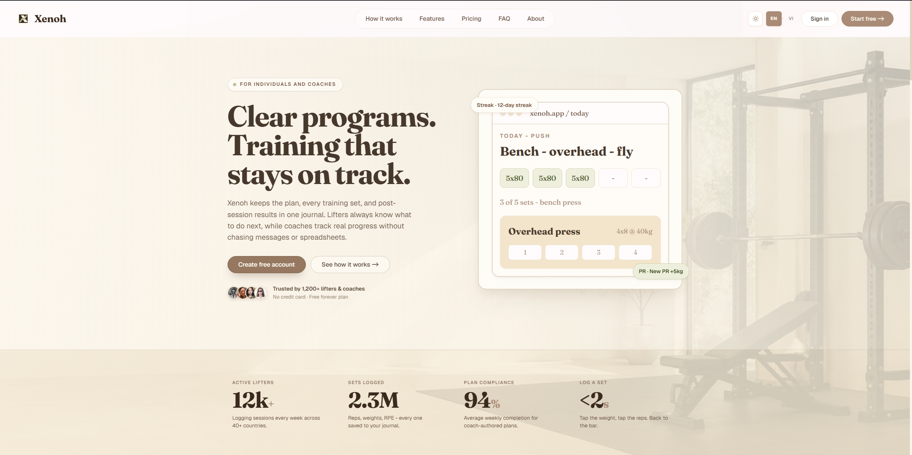
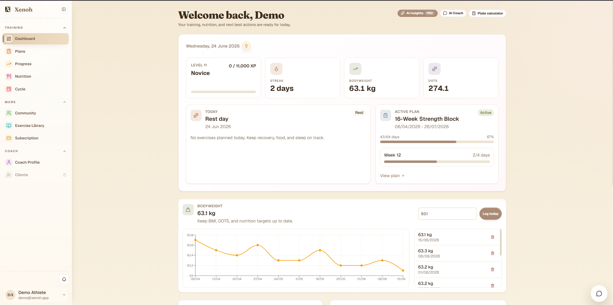
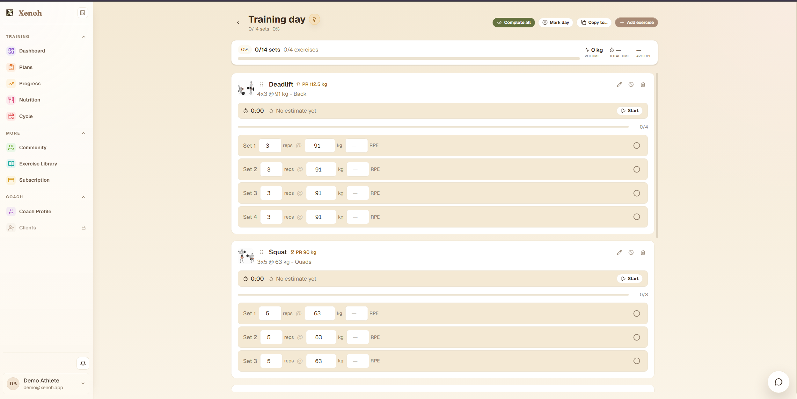
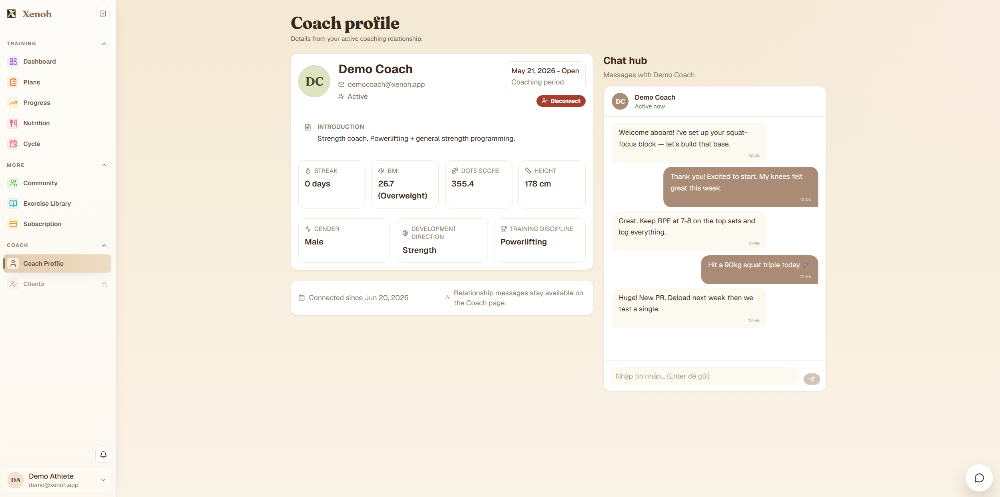
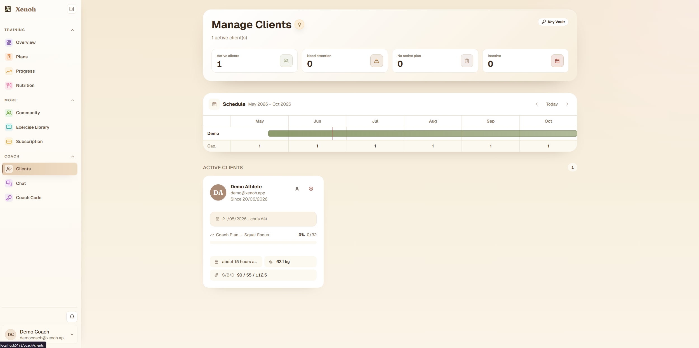
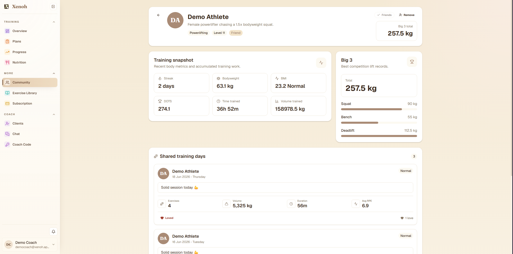
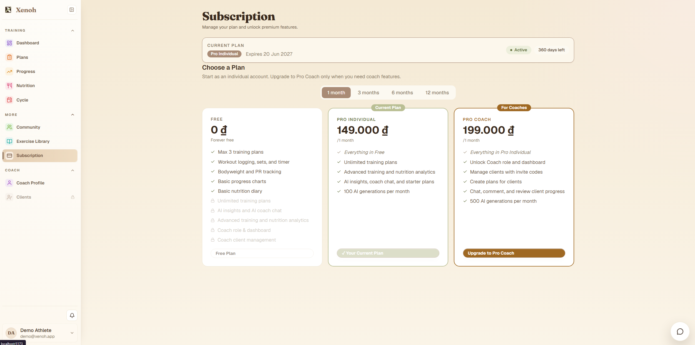

# Xenoh API

<div align="center">

**Training management for lifters and coaches.**

Plan workouts, log every set, track progress, manage nutrition, collaborate with a coach, and turn training history into useful insight.

[Website](https://www.xenoh.online) · [API](https://api.xenoh.online)


</div>



## What Xenoh does

Xenoh keeps the complete training workflow in one system. Athletes can follow structured programs and record results while coaches can manage clients, review progress, and communicate without relying on separate spreadsheets or messaging tools.

| Area | Capabilities |
| --- | --- |
| Training | Multi-week plans, daily workouts, exercise ordering, set logging, timers, RPE, volume, personal records, and completion tracking |
| Progress | Bodyweight history, BMI, DOTS, streaks, training time, accumulated volume, lift progression, and training insights |
| Coaching | Invite-code connections, contracts, client schedules, plan assignment, comments, attention flags, and client analysis |
| Community | Friend discovery, shared training days, reactions, public profiles, reporting, and blocking |
| Nutrition | Food diary, macro targets, meal tracking, food search, and AI-assisted food analysis |
| Intelligence | Plan analysis, athlete summaries, risks, opportunities, recommendations, and quota-controlled AI features |
| Communication | Real-time coach/client messaging and notifications through SignalR |
| Accounts | ASP.NET Core Identity, JWT access and refresh tokens, Google/Facebook login, roles, and subscription policies |
| Billing | Free, Pro Individual, and Pro Coach tiers with SePay payment integration |

## Product tour

### Athlete dashboard

The dashboard combines the current plan, today's workout, XP, streak, bodyweight, DOTS, next actions, and recent bodyweight history.



### Workout logging

Training days provide set-by-set logging for reps, weight, and RPE, plus exercise timers, progress, volume, duration, personal records, and completion controls.



### Coach profile and chat

Athletes can review the active coaching relationship, see coach details, and communicate through a real-time conversation alongside the coaching context.



### Client management

The coach workspace shows active clients, capacity, attention states, assigned-plan progress, and a schedule covering the coaching period.



### Community profiles

Community profiles summarize training metrics, competition lifts, friendship state, and shared training days.



### Subscription management

Subscriptions separate the core training experience from advanced individual analytics and the complete coach workspace.



## Backend stack

- .NET 10 and ASP.NET Core Web API
- PostgreSQL with Entity Framework Core 10 and Npgsql
- ASP.NET Core Identity with JWT access and refresh tokens
- CQRS with source-generated mediator handlers
- Mapster for object mapping
- SignalR for messages and notifications
- Scalar and OpenAPI for development API documentation
- Prometheus HTTP and runtime metrics
- AWS S3-compatible storage for avatars and generated share images
- MailKit for transactional email
- Google and Facebook external authentication
- SePay payment integration
- xUnit and FluentAssertions

## Architecture

The solution follows Clean Architecture. Inner layers do not depend on the web host or infrastructure implementations.

```text
src/
├── Xenoh.Domain/          Entities, value objects, enums, and domain rules
├── Xenoh.Application/     Commands, queries, handlers, DTOs, and interfaces
├── Xenoh.Infrastructure/  EF Core, Identity, repositories, storage, email, AI, and SignalR
└── Xenoh.API/             Controllers, authentication, middleware, policies, and composition root

tests/
└── Xenoh.Application.Tests/
```

Dependency direction:

```text
API ───────────────► Application ───────────────► Domain
 │                         ▲
 └────► Infrastructure ────┘
              │
              └───────────────────────────────► Domain
```

Controllers remain thin. Application handlers own use-case logic, while Infrastructure implements persistence and external-service concerns.

## Run locally

### Prerequisites

- [.NET 10 SDK](https://dotnet.microsoft.com/download/dotnet/10.0)
- PostgreSQL
- Optional: EF Core CLI for explicit migration commands

```powershell
dotnet tool install --global dotnet-ef
```

### 1. Configure development settings

From the repository root:

```powershell
Copy-Item `
  src/Xenoh.API/appsettings.Development.example.json `
  src/Xenoh.API/appsettings.Development.json
```

At minimum, replace the local PostgreSQL password and JWT signing key. Configure SMTP, OAuth, SePay, OpenAI, and object storage when testing those integrations.

The JWT key must contain at least 32 characters. Never commit real credentials.

### 2. Restore and build

```powershell
dotnet restore Xenoh.slnx
dotnet build Xenoh.slnx
```

### 3. Start the API

```powershell
dotnet run --project src/Xenoh.API --launch-profile http
```

The application initializes the database, applies pending migrations, and seeds baseline data during startup.

### 4. Rebuild and seed complete demo data (development only)

To permanently drop the configured Development database, recreate it from every
migration, synchronize reference data, and load the complete demo dataset:

```powershell
$env:DOTNET_ENVIRONMENT = "Development"
dotnet run --project src/Xenoh.API -- --rebuild-demo-database
```

To refresh only the demo accounts and their data without rebuilding the schema:

```powershell
$env:DOTNET_ENVIRONMENT = "Development"
dotnet run --project src/Xenoh.API -- --seed-demo-database
```

Both commands refuse to run outside Development. The seed recreates these accounts:

| Account | Password | Roles | Subscription |
| --- | --- | --- | --- |
| `admin@xenoh.app` | `Admin@Xenoh123!` | Admin, Coach, Individual | Pro Coach |
| `demo@xenoh.app` | `Demo@Xenoh123!` | Individual | Pro Individual |
| `democoach@xenoh.app` | `Coach@Xenoh123!` | Coach, Individual | Pro Coach |
| `free@xenoh.app` | `Demo@Xenoh123!` | Individual | Free |

The data covers active self and coach-authored plans, completed/upcoming/missed
workouts, bodyweight and PR history, nutrition, cycle tracking, coaching and chat,
friendships, community shares, billing and promotions, AI usage,
notifications, moderation, bug reports, website analytics, supplements, and a
published competition with an approved registration. The SQL is embedded into the
Infrastructure assembly from `docs/seeds/clean-seed.sql` and runs in one transaction.

Development endpoints:

| Resource | URL |
| --- | --- |
| API | `http://localhost:5293` |
| Scalar API reference | `http://localhost:5293/scalar/v1` |
| OpenAPI document | `http://localhost:5293/openapi/v1.json` |
| Prometheus metrics | `http://localhost:5293/metrics` |

To apply migrations explicitly:

```powershell
dotnet ef database update `
  --project src/Xenoh.Infrastructure `
  --startup-project src/Xenoh.API
```

## Tests

```powershell
dotnet test Xenoh.slnx
```

## Authentication

The API supports email/password authentication, JWT refresh-token rotation, password recovery, and external login.

Production OAuth entry points:

```text
https://api.xenoh.online/api/auth/external/google
https://api.xenoh.online/api/auth/external/facebook
```

Provider callback URLs:

```text
https://api.xenoh.online/api/auth/external/google/callback
https://api.xenoh.online/api/auth/external/facebook/callback
```

When deployed behind a reverse proxy, forward the original host, scheme, and client address. Incorrect forwarded-header configuration causes OAuth providers to receive an internal HTTP callback URL.

```nginx
proxy_set_header Host $host;
proxy_set_header X-Forwarded-Host $host;
proxy_set_header X-Forwarded-Proto $scheme;
proxy_set_header X-Forwarded-For $proxy_add_x_forwarded_for;
```

## Production deployment

The repository includes a production Dockerfile. The workspace-level `deploy/aws-ec2` directory contains the Docker Compose service, Nginx configuration, environment template, and systemd unit used for AWS EC2 deployment.

Production configuration is supplied through environment variables using ASP.NET Core's double-underscore convention:

```text
ConnectionStrings__DefaultConnection
Redis__Enabled
Redis__ConnectionString
Jwt__Key
Authentication__FrontendUrl
OpenAi__ApiKey
R2Avatar__AccessKeyId
R2Share__AccessKeyId
```

The API validates required production settings at startup and rejects missing values, placeholders, or JWT keys shorter than 32 characters.

When Redis is enabled, configure persistence and a `noeviction` memory policy: active JWT revocations are stored there until their access token expires. Redis outages fall back to PostgreSQL for revocation checks; cache-backed reads fall back to PostgreSQL automatically.

## Security and operations

- Role- and subscription-policy authorization
- Token revocation through refresh-token blacklisting
- Configurable global, authentication, AI, and webhook rate limits
- Strict forwarded-header trust configuration
- Security response headers and production HSTS
- CORS allowlists with a separate public-share policy
- Prometheus metrics that can be disabled outside private monitoring paths
- Containers bound to loopback behind Nginx with dropped Linux capabilities
- Secrets excluded from source control through private development settings and production environment files

## License

No license has been specified for this repository.
