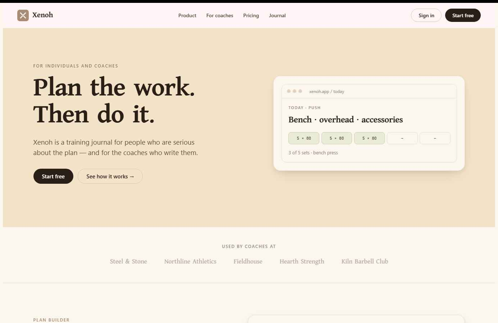
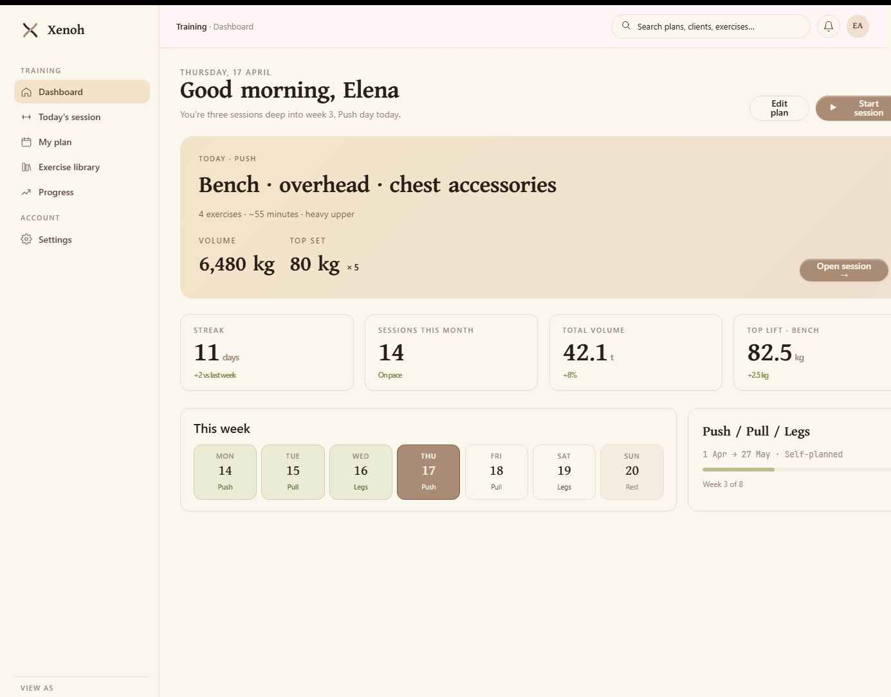
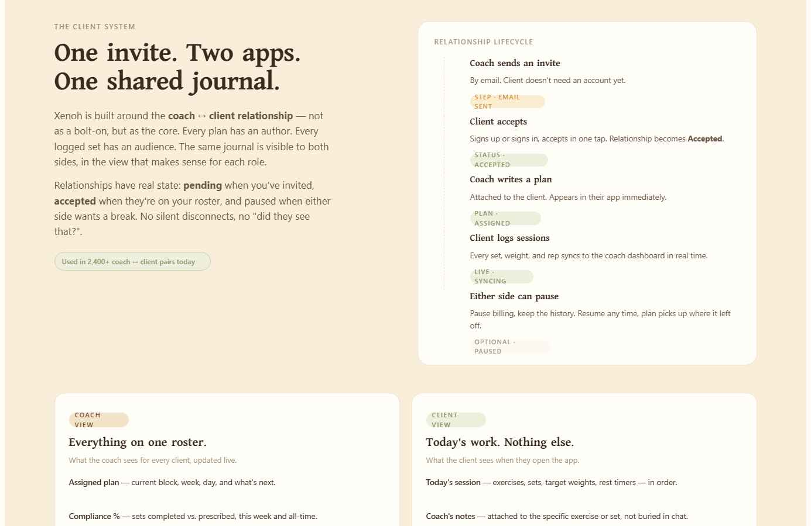

# Xenoh

Training journal for lifters. Client management for coaches.

Xenoh helps users plan workouts, log sessions, track progress, and share training plans between coaches and clients.



## Preview

### Public Website


### Training Dashboard



### Coach And Client System



## What Xenoh Does

- Build training plans.
- Log sets, reps, weight, and completed work.
- Track volume, streaks, progress, and personal records.
- Let individuals train without a coach.
- Let coaches assign plans and monitor clients.
- Keep coach-client training history in one shared place.

## MVP Features

| Area | MVP |
| --- | --- |
| Public site | Landing page, pricing, FAQ, about page |
| Auth | Register, login, JWT-protected API |
| Training | Plans, sessions, exercise library, progress history |
| Coach tools | Client roster, plan assignment, client updates |
| Payments | Coach billing support |
| Backend | Clean Architecture ASP.NET Core API |

## Backend Stack

- ASP.NET Core
- PostgreSQL
- Entity Framework Core
- ASP.NET Core Identity + JWT
- CQRS with Mediator
- Mapster
- Clean Architecture

## Project Structure

```text
src/
  Xenoh.API
  Xenoh.Application
  Xenoh.Domain
  Xenoh.Infrastructure
tests/
  Xenoh.Application.Tests
```

<details>
<summary>Run the backend locally</summary>

### Prerequisites

- .NET SDK compatible with the solution target framework
- PostgreSQL
- EF Core CLI

```powershell
dotnet tool install --global dotnet-ef
```

### Configure

Create a private local config:

```powershell
Copy-Item src/Xenoh.API/appsettings.Development.example.json src/Xenoh.API/appsettings.Development.json
```

Update:

- PostgreSQL connection string
- JWT settings
- SMTP settings
- OAuth settings
- Payment settings
- AI provider settings, if used

Do not commit real secrets.

### Database

```powershell
dotnet restore
dotnet ef database update --project src/Xenoh.Infrastructure --startup-project src/Xenoh.API
```

### Start API

```powershell
dotnet run --project src/Xenoh.API
```

Local URLs may include:

```text
http://localhost:5293
https://localhost:7017
```

</details>

<details>
<summary>Development notes</summary>

- Keep controllers thin.
- Put business logic in `Xenoh.Application`.
- Keep `Xenoh.Domain` pure.
- Use repositories through Application interfaces.
- Use Mapster for mapping.
- Use async I/O.
- Use `AsNoTracking()` for read-only EF queries.
- Keep secrets in local config or deployment secret storage.

Run tests:

```powershell
dotnet test
```

</details>

## Security

Public config files contain placeholders only. Local secrets are ignored by Git.

Before publishing or deploying:

```powershell
git status --short
git grep -n "password" -- .
git grep -n "secret" -- .
git grep -n "sk-" -- .
```

Rotate any credential that was ever exposed.

## License

No license has been specified yet.
