# Xenoh

Training journal for lifters. Coaching workspace for coaches. AI-assisted insight for both.

Xenoh helps athletes follow plans, log workouts, track progress, manage nutrition, and work with coaches in one shared system.

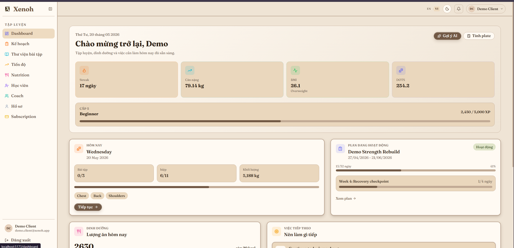

## MVP Features

| Area | Features |
| --- | --- |
| Athlete dashboard | Daily workout, active plan, nutrition, next actions, streak, bodyweight, BMI, DOTS, XP |
| Training plans | Weekly timeline, current week, completion status, below-target warnings, coach-client comments |
| Workout logging | Exercises, sets, reps, weight, RPE, PR badges, volume, total time, AI suggestions |
| Progress analytics | Training score, sessions, total volume, compliance, recommendations, muscle heatmaps |
| Coach connection | Invite-code based coach connection, contract status, report, block, disconnect |
| Coach workspace | Client roster, active/inactive status, attention flags, missing plans, schedule timeline |
| Client management | Client stats, plan progress, custom exercises, nutrition access, AI analysis |
| AI insight | Client summary, risks, opportunities, plan balance, mistakes to fix, programming suggestions |
| Billing | Subscription and coach billing support |

## Product Screens

### 1. Athlete Dashboard

Daily overview for the athlete: today's workout, plan progress, nutrition, next actions, streak, bodyweight, BMI, DOTS, and XP.


### 2. Training Plan Timeline

The active plan is displayed as weekly cards with current-week status, completion percentage, warnings, and shared comments.

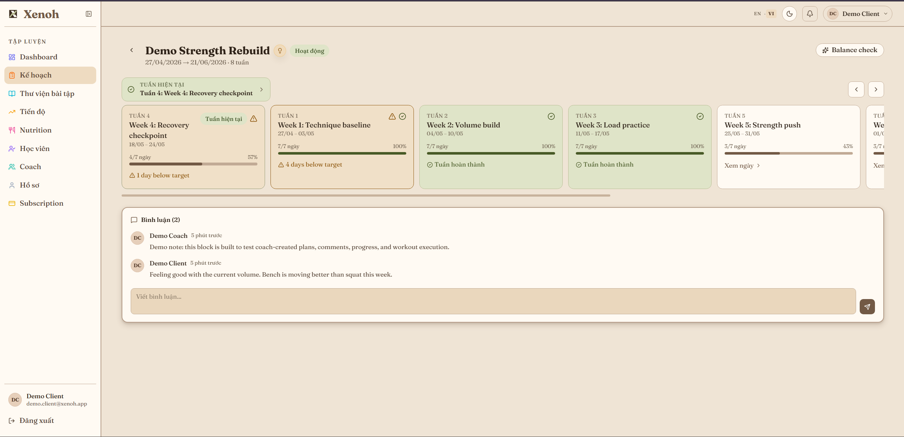

### 3. Workout Logging

Athletes log each exercise set by set, including reps, weight, RPE, total volume, total time, PR context, and completion state.

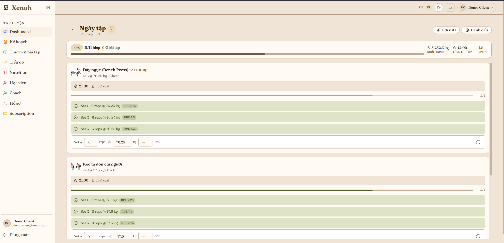

### 4. Progress Analytics

Progress view turns training history into scores, compliance, recommendations, weekly muscle-group heatmaps, and body heatmaps.

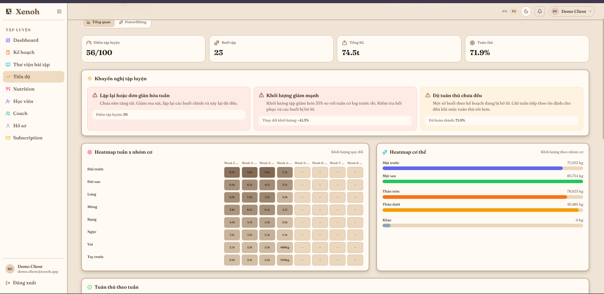

### 5. Coach Connection

Athletes can connect with a coach by invite code, view relationship state, and use report, block, or disconnect actions.

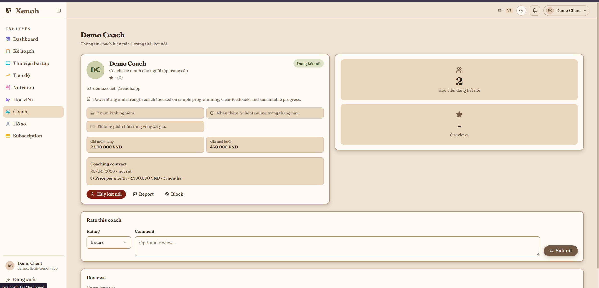

### 6. Coach Client Roster

Coaches manage active clients, inactive clients, attention flags, missing plans, schedule timeline, and client performance cards.

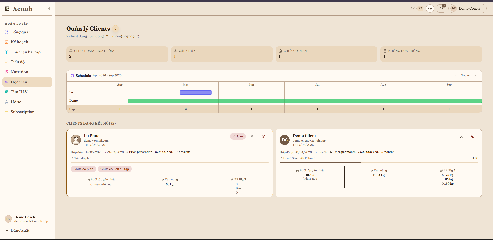

### 7. AI Plan Analysis

AI reviews the structure of a training plan, highlights mistakes, suggests improvements, and summarizes completion, workload, time, and RPE.

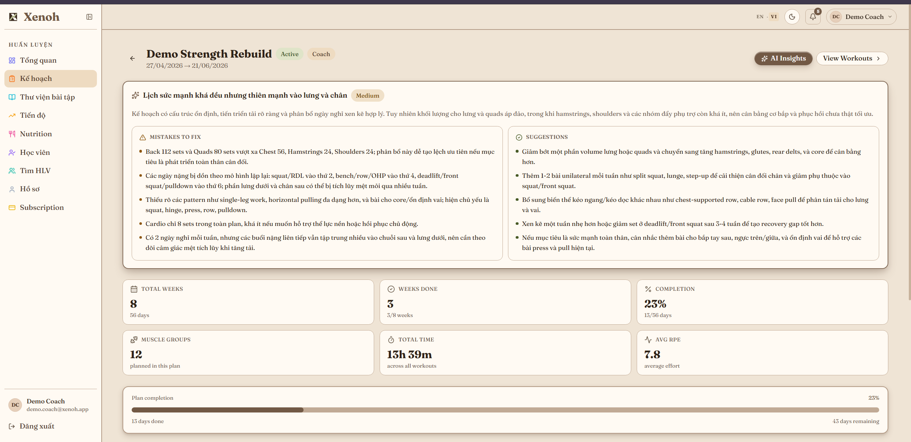

### 8. AI Client Insight

AI summarizes a client's recent progress, risks, opportunities, PRs, consistency, and training direction.

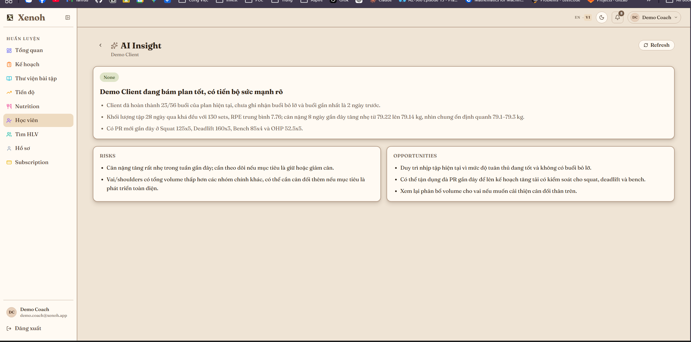

### 9. Coach Client Detail

Coaches can inspect client stats, plan progress, assigned plans, custom exercises, nutrition, and AI analysis from one page.

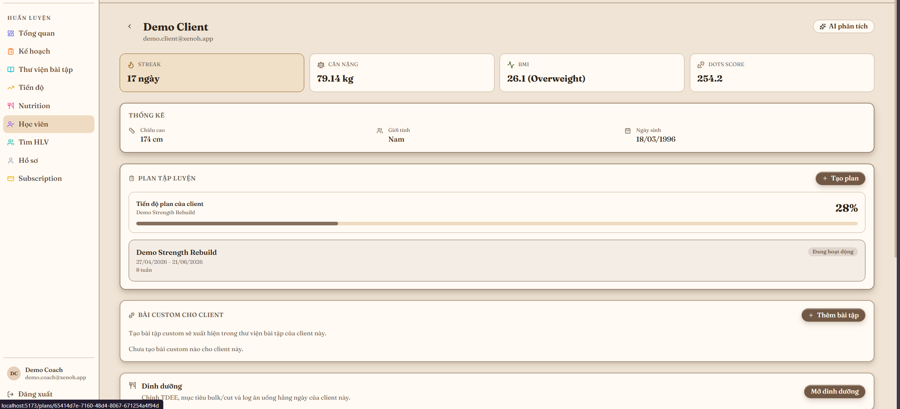

## Public Website

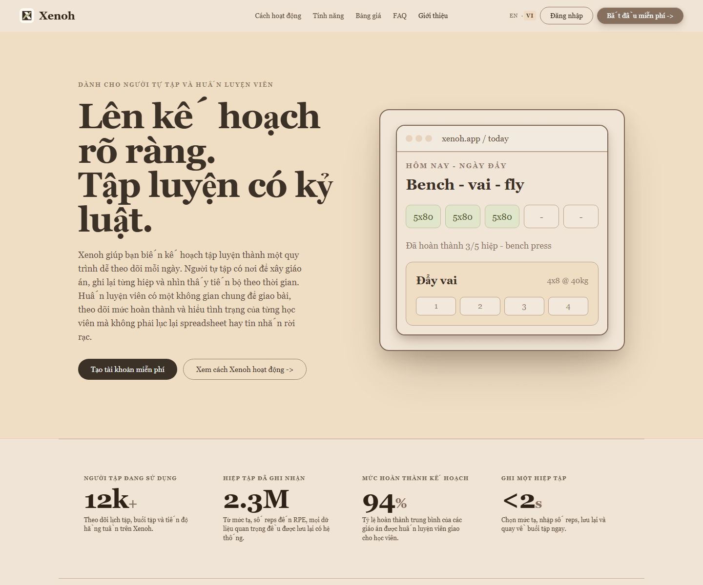

### About


### Login

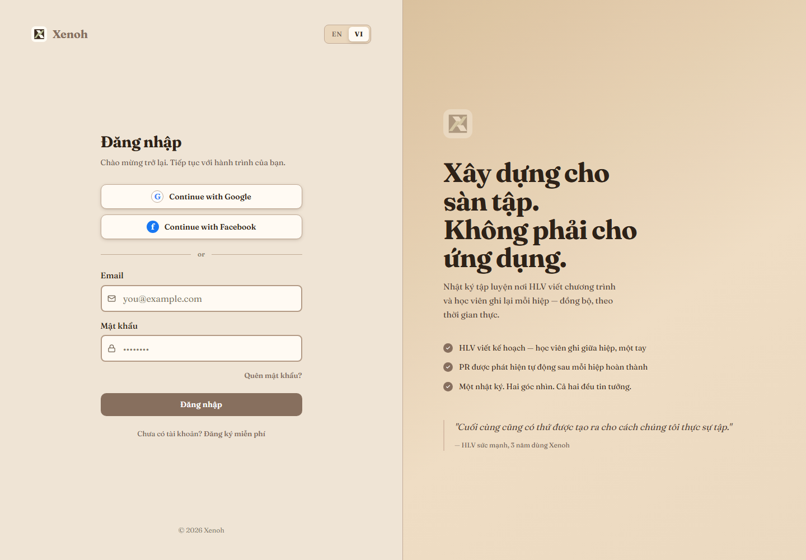

### Register

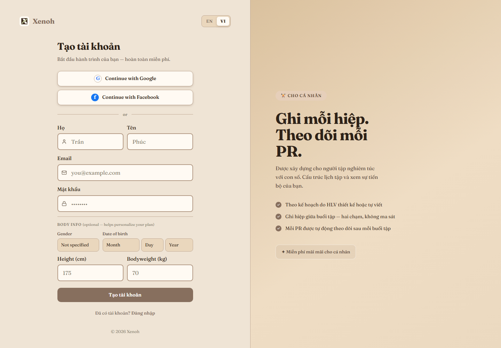

## Backend Stack

- ASP.NET Core
- PostgreSQL
- Entity Framework Core
- ASP.NET Core Identity + JWT
- CQRS with Mediator
- Mapster
- Clean Architecture

## Project Structure

```text
src/
  Xenoh.API
  Xenoh.Application
  Xenoh.Domain
  Xenoh.Infrastructure
tests/
  Xenoh.Application.Tests
```

<details>
<summary>Run the backend locally</summary>

### Prerequisites

- .NET SDK compatible with the solution target framework
- PostgreSQL
- EF Core CLI

```powershell
dotnet tool install --global dotnet-ef
```

### Configure

Create a private local config:

```powershell
Copy-Item src/Xenoh.API/appsettings.Development.example.json src/Xenoh.API/appsettings.Development.json
```

Update:

- PostgreSQL connection string
- JWT settings
- SMTP settings
- OAuth settings
- Payment settings
- AI provider settings, if used

Do not commit real secrets.

### Database

```powershell
dotnet restore
dotnet ef database update --project src/Xenoh.Infrastructure --startup-project src/Xenoh.API
```

### Start API

```powershell
dotnet run --project src/Xenoh.API
```

Local URLs may include:

```text
http://localhost:5293
https://localhost:7017
```

</details>

## Security

Public config files contain placeholders only. Local secrets are ignored by Git.

```powershell
git status --short
git grep -n "password" -- .
git grep -n "secret" -- .
git grep -n "sk-" -- .
```

Rotate any credential that was ever exposed.

## License

No license has been specified yet.
